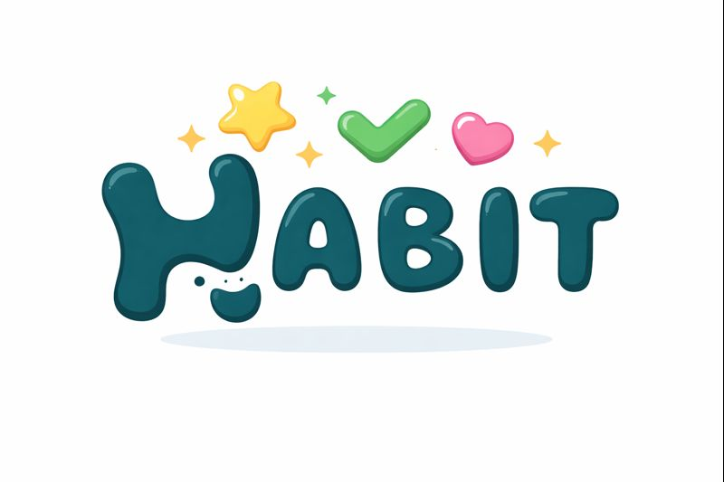
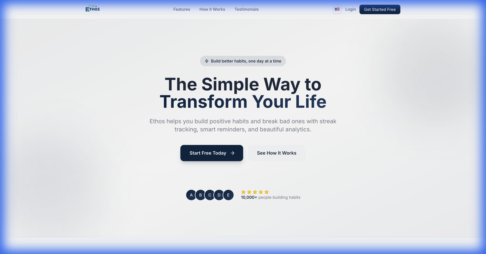
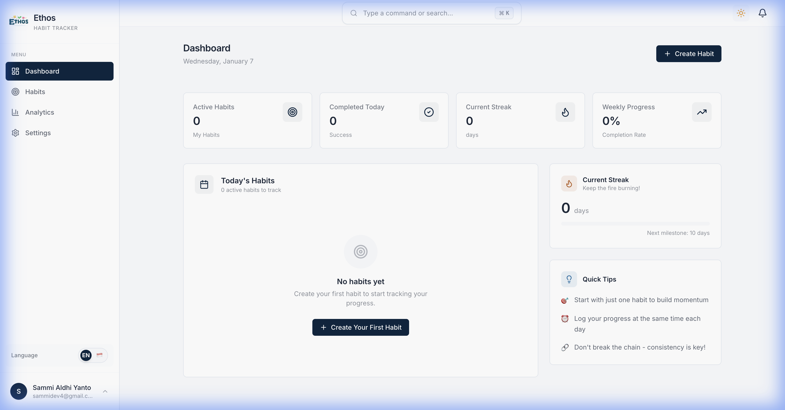
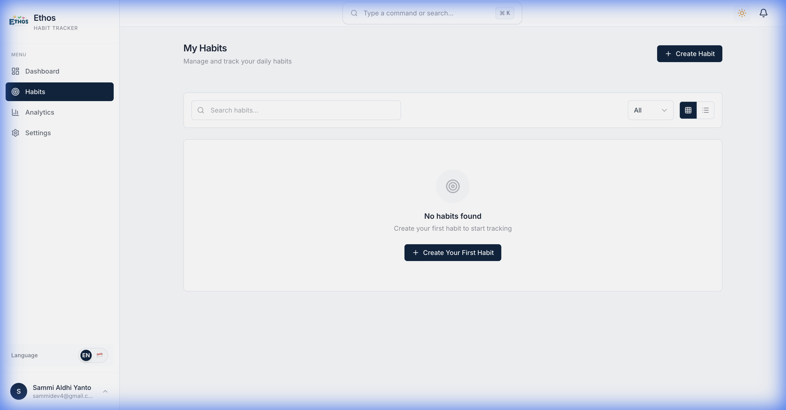
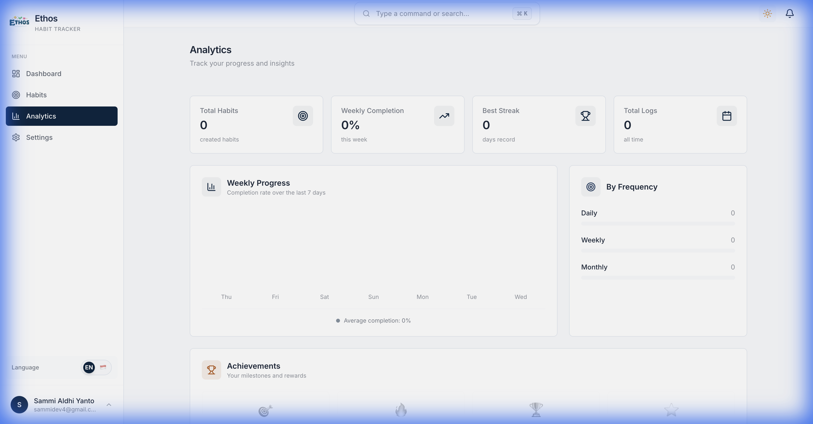

# Ethos - Modern Habit Tracker

<div align="center">
  

  <h3>High-Performance Go Backend + Embedded React Frontend</h3>

  <p>
    <a href="https://go.dev"></a>
    <a href="https://react.dev"></a>
    <a href="https://postgres.org"></a>
    <a href="https://docker.com"></a>
  </p>

  <p>_Build better habits, one day at a time._</p>

  <p>
    <a href="#key-features">Features</a> •
    <a href="#quick-start">Quick Start</a> •
    <a href="#architecture">Architecture</a> •
    <a href="docs/screenshots/">Screenshots</a> •
    <a href="CLAUDE.md">Docs</a>
  </p>
</div>

---

## Overview

**Ethos** is a production-grade habit tracking application built to demonstrate **advanced Go patterns**, **Clean Architecture**, and **Single Binary Architecture**.

It simplifies deployment by embedding the React frontend directly into the Go binary. **One file is all you need.**

## Screenshots

<div align="center">

|                      Landing Page                      |                        Dashboard                         |
| :----------------------------------------------------: | :------------------------------------------------------: |
|  |  |

|                        Habits                         |                        Analytics                         |
| :---------------------------------------------------: | :------------------------------------------------------: |
|  |  |

</div>

## Key Features

- **Habit Tracking**: Create, track, and visualize daily habits.
- **Why It Matters**: Build consistency with streaks and analytics.
- **Single Binary**: Zero-config deployment (Go + React embedded).
- **Clean Architecture**: Domain-Driven Design (DDD) & CQRS.
- **gRPC API**: High-performance gRPC services with JSON Gateway.
- **Observability**: LGTM Stack (Loki, Grafana, Tempo, Mimir).
- **Security**: JWT Auth, Rate Limiting, Secure Headers.

## Quick Start

### 1. The Easy Way (Docker)

```bash
git clone https://github.com/semmidev/ethos-go.git
cd ethos-go
cp .env.example .env

# Starts Backend, Frontend, DB, Redis, and Observability stack
make dev
```

Visit **http://localhost:8080**.

### 2. The Hacker Way (Single Binary)

```bash
# Build everything into one binary
make build

# Run it
./build/ethos-go
```

## Architecture

Ethos adheres to **Clean Architecture**:

```bash
ethos-go/
├── internal/
│   ├── {module}/       # Feature Modules (Auth, Habits)
│   │   ├── domain/     # Business Logic (Pure Go)
│   │   ├── app/        # Use Cases (CQRS)
│   │   ├── adapters/   # DB Implementation
│   │   └── ports/      # gRPC Servers & Handlers
```

See **[CLAUDE.md](CLAUDE.md)** for detailed development guidelines.

## Tech Stack

| Component | Tech                     |
| :-------- | :----------------------- |
| **Lang**  | Go 1.25+                 |
| **Web**   | React 19, Vite, Tailwind |
| **API**   | gRPC + Buf               |
| **Data**  | PostgreSQL 17, Redis 8   |
| **Ops**   | Docker, K8s, Grafana     |

## Contributing

Pull requests are welcome. For major changes, please open an issue first.

## License

[MIT](LICENSE)
