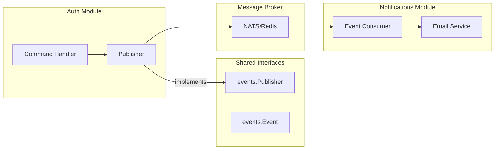

# Ethos - Modern Habit Tracker

<div align="center">
  

  <h3>High-Performance Go Backend + Embedded React Frontend</h3>

  <p>
    <a href="https://go.dev"></a>
    <a href="https://react.dev"></a>
    <a href="https://postgres.org"></a>
    <a href="https://docker.com"></a>
  </p>

  <p>_Build better habits, one day at a time._</p>

  <p>
    <a href="#key-features">Features</a> •
    <a href="#quick-start">Quick Start</a> •
    <a href="#architecture">Architecture</a> •
    <a href="docs/screenshots/">Screenshots</a> •
    <a href="CLAUDE.md">Docs</a>
  </p>
</div>

---

## Overview

**Ethos** is a production-grade habit tracking application built to demonstrate **advanced Go patterns**, **Clean Architecture**, and **Single Binary Architecture**.

It simplifies deployment by embedding the React frontend directly into the Go binary. **One file is all you need.**

## Screenshots

<div align="center">

|                      Landing Page                      |                        Dashboard                         |
| :----------------------------------------------------: | :------------------------------------------------------: |
|  |  |

|                        Habits                         |                        Analytics                         |
| :---------------------------------------------------: | :------------------------------------------------------: |
|  |  |

</div>

## Key Features

- **Habit Tracking**: Create, track, and visualize daily habits.
- **Why It Matters**: Build consistency with streaks and analytics.
- **Single Binary**: Zero-config deployment (Go + React embedded).
- **Clean Architecture**: Domain-Driven Design (DDD) & CQRS.
- **gRPC API**: High-performance gRPC services with JSON Gateway.
- **Observability**: LGTM Stack (Loki, Grafana, Tempo, Mimir).
- **Security**: JWT Auth, Rate Limiting, Secure Headers.

## Quick Start

### 1. The Easy Way (Docker)

```bash
git clone https://github.com/semmidev/ethos-go.git
cd ethos-go
cp .env.example .env

# Starts Backend, Frontend, DB, Redis, and Observability stack
make dev
```

Visit **http://localhost:8080**.

### 2. The Hacker Way (Single Binary)

```bash
# Build everything into one binary
make build

# Run it
./build/ethos-go
```

## Architecture

Ethos adheres to **Clean/Hexagonal Architecture** with **CQRS**:


### Project Structure

```bash
ethos-go/
├── cmd/                    # Application entry points
│   ├── server/             # Main API server
│   └── worker/             # Background job worker
├── internal/
│   ├── auth/               # Authentication module
│   ├── habits/             # Habit tracking module
│   ├── notifications/      # Notification module
│   ├── common/             # Shared utilities
│   └── generated/          # Generated gRPC code
├── api/                    # Protocol Buffer definitions
├── migrations/             # Database migrations
└── frontend/               # Embedded React application
```

### Layer Responsibilities

| Layer           | Directory   | Responsibility                                                             |
| --------------- | ----------- | -------------------------------------------------------------------------- |
| **Domain**      | `domain/`   | Business entities, rules, and port interfaces. Zero external dependencies. |
| **Application** | `app/`      | Use cases (Commands/Queries), orchestrates domain logic.                   |
| **Adapters**    | `adapters/` | Implements domain ports (PostgreSQL, JWT, BCrypt).                         |
| **Ports**       | `ports/`    | Entry points (gRPC servers, HTTP handlers).                                |
| **Service**     | `service/`  | Dependency injection and wiring.                                           |

### Design Decisions

#### 1. Domain Entity Encapsulation

Entities use **private fields** with **getters/setters** to enforce invariants:

```go
// ✅ Good: Encapsulated entity
type User struct {
    userID  uuid.UUID  // Private
    email   string
}

func (u *User) Email() string { return u.email }
func (u *User) SetEmail(email string) { u.email = email }
```

**Why?** Prevents invalid state mutations and enforces business rules at the domain level.

#### 2. Interface Segregation (ISP)

Repository interfaces are split by read/write concerns:

```go
type UserReader interface {
    FindByEmail(ctx context.Context, email string) (*User, error)
    FindByID(ctx context.Context, userID uuid.UUID) (*User, error)
}

type UserWriter interface {
    Create(ctx context.Context, user *User) error
    Update(ctx context.Context, user *User) error
}

type Repository interface {
    UserReader
    UserWriter
}
```

**Why?** Query handlers only need `UserReader`, avoiding unnecessary dependencies.

#### 3. CQRS Pattern

Commands (writes) and Queries (reads) are separated into distinct handlers:

```go
// Commands: Mutate state
type Commands struct {
    Register  RegisterHandler
    Login     LoginHandler
    // ...
}

// Queries: Read-only operations
type Queries struct {
    GetProfile   GetProfileHandler
    ListSessions ListSessionsHandler
    // ...
}
```

**Why?** Enables independent scaling, clearer intent, and simpler testing.

#### 4. Decorator Pattern for Cross-Cutting Concerns

Logging, metrics, and tracing are wrapped around handlers:

```go
func NewLoginHandler(...) LoginHandler {
    return decorator.ApplyCommandResultDecorators(
        loginHandler{...},
        logger,
        metricsClient,
    )
}
```

**Why?** Keeps business logic clean; cross-cutting concerns are composable.

#### 5. Dependency Inversion

Domain defines interfaces; adapters implement them:

```go
// Domain defines the contract
type TokenIssuer interface {
    IssueAccessToken(ctx, userID, sessionID, expiresAt) (string, error)
}

// Adapter implements it
type JWTTokenIssuer struct { ... }
func (j *JWTTokenIssuer) IssueAccessToken(...) (string, error) { ... }
```

**Why?** Domain remains testable and framework-agnostic.

#### 6. Thin Controllers (Ports)

gRPC/HTTP handlers only translate requests and delegate to use cases:

```go
func (s *AuthGRPCServer) Login(ctx, req) (*LoginResponse, error) {
    cmd := command.LoginCommand{Email: req.Email, Password: req.Password}
    result, err := s.loginHandler.Handle(ctx, cmd)
    if err != nil {
        return nil, toGRPCError(err)
    }
    return &LoginResponse{AccessToken: result.AccessToken}, nil
}
```

**Why?** Keeps transport concerns separate from business logic.

See **[CLAUDE.md](CLAUDE.md)** for detailed development guidelines.

### Module Communication Patterns

Modules communicate via **3 primary mechanisms**:



#### 1. Event-Driven Communication (Loose Coupling)

Modules publish domain events; other modules subscribe and react:

```go
// internal/common/events/publisher.go - Shared interface
type Publisher interface {
    Publish(ctx context.Context, event Event) error
    PublishAll(ctx context.Context, events []Event) error
    Close() error
}

// internal/common/events/event.go - Base event interface
type Event interface {
    EventID() string
    EventType() string      // e.g., "auth.user.registered"
    OccurredAt() time.Time
    AggregateID() string    // e.g., user ID
    AggregateType() string  // e.g., "user"
}
```

**Auth Module publishes events:**

```go
// internal/auth/domain/events/user_events.go
type UserRegistered struct {
    events.BaseEvent
    UserID       string `json:"user_id"`
    Email        string `json:"email"`
    Name         string `json:"name"`
    AuthProvider string `json:"auth_provider"`
}

func NewUserRegistered(userID, email, name, authProvider string) UserRegistered {
    return UserRegistered{
        BaseEvent:    events.NewBaseEvent("auth.user.registered", "user", userID),
        UserID:       userID,
        Email:        email,
        Name:         name,
        AuthProvider: authProvider,
    }
}
```

**Command handler uses the publisher:**

```go
// internal/auth/app/command/register.go
type registerHandler struct {
    userRepo  user.Repository
    publisher events.Publisher  // Injected dependency
}

func (h registerHandler) Handle(ctx context.Context, cmd RegisterCommand) (*RegisterResult, error) {
    // ... create user logic ...

    // Publish event (other modules can react)
    event := authevents.NewUserRegistered(
        newUser.UserID().String(),
        newUser.Email(),
        newUser.Name(),
        "email",
    )
    _ = h.publisher.Publish(ctx, event)

    return &RegisterResult{UserID: newUser.UserID()}, nil
}
```

**Notifications Module listens and reacts:**

```go
// internal/notifications/consumer.go
func (c *Consumer) handleUserRegistered(ctx context.Context, event events.UserRegistered) error {
    // Send welcome email
    return c.emailService.SendWelcomeEmail(ctx, event.Email, event.Name)
}
```

#### 2. Shared Interfaces (Common Package)

Modules depend on shared abstractions, not concrete implementations:

```go
// internal/common/events/publisher.go
type Publisher interface { ... }

// internal/common/database/dbtx.go
type DBTX interface {
    ExecContext(ctx, query, args...) (sql.Result, error)
    QueryRowxContext(ctx, query, args...) *sqlx.Row
    // ...
}

// internal/common/validator/validator.go
type Validator struct { ... }
```

**Modules import only the interface, not the implementation:**

```go
// Auth module uses Publisher interface
import "github.com/semmidev/ethos-go/internal/common/events"

type loginHandler struct {
    publisher events.Publisher  // Interface, not NATSPublisher
}
```

#### 3. Cross-Module Data Access (Anti-Corruption Layer)

When modules need data from other modules, use **read-only interfaces**:

```go
// Habits module needs user timezone (owned by Auth)
// Option A: Query via shared read interface
type UserReader interface {
    FindByID(ctx context.Context, userID uuid.UUID) (*User, error)
}

// Option B: Include in JWT claims (preferred for frequently accessed data)
type TokenClaims struct {
    UserID    uuid.UUID
    Timezone  string  // Cached from Auth module
}
```

#### Communication Pattern Summary

| Pattern               | Use Case                                 | Example                               |
| --------------------- | ---------------------------------------- | ------------------------------------- |
| **Events**            | Async notifications, decoupled reactions | `UserRegistered` → Send welcome email |
| **Shared Interfaces** | Common abstractions                      | `Publisher`, `DBTX`, `Validator`      |
| **Read Interfaces**   | Cross-module queries                     | `UserReader` for timezone lookup      |
| **JWT Claims**        | Frequently accessed user data            | UserID, Timezone in token             |

#### Why NOT Direct Module Imports?

```go
// ❌ Bad: Habits module imports Auth internals
import "github.com/semmidev/ethos-go/internal/auth/domain/user"

// ✅ Good: Habits module uses shared interface or events
import "github.com/semmidev/ethos-go/internal/common/events"
```

**Benefits:**

- Modules can be developed/tested independently
- Changes in one module don't break others
- Easy to replace implementations (NATS → Kafka)
- Clear module boundaries for future microservices split

## Tech Stack

| Component | Tech                     |
| :-------- | :----------------------- |
| **Lang**  | Go 1.25+                 |
| **Web**   | React 19, Vite, Tailwind |
| **API**   | gRPC + Buf               |
| **Data**  | PostgreSQL 17, Redis 8   |
| **Ops**   | Docker, K8s, Grafana     |

## Contributing

Pull requests are welcome. For major changes, please open an issue first.

## License

[MIT](LICENSE)
